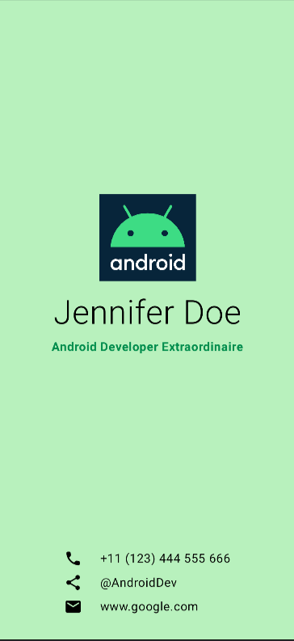
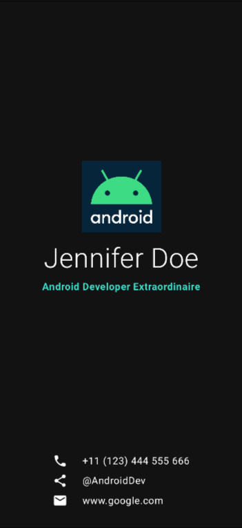

 Business Card App

Простое Android-приложение-визитка на Jetpack Compose. Демонстрирует создание красивого, responsive UI для личной визитки с анимациями и темами.

## 📱 Описание

Это учебный проект, где я реализовал цифровую визитку с:
- Личными данными (имя, фото, контакты)
- Кнопками для соцсетей
- Адаптивным дизайном (light/dark theme)
- Плавными анимациями

## 🚀 Функции

- [x] Отображение фото и bio
- [x] Кликабельные ссылки (email, LinkedIn, GitHub)
- [x] Темная/светлая тема
- [x] Анимация появления элементов

## 📸 Скриншоты

| Светлая тема | Тёмная тема |
|--------------|-------------|
|  |  |

## 🛠 Технологии

- Kotlin + Jetpack Compose
- Material 3 (темы и компоненты)
- Android Studio (разработка)

## 📦 Установка и запуск

1. Склонируй репозиторий:
   ```bash
   git clone https://github.com/MORSONLEND1/Business_card.git
   cd Business_card
